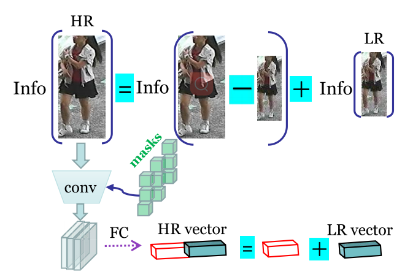

# Learning Resolution-Adaptive Representations for Cross-Resolution Person Re-Identification

IEEE TRANSACTIONS ON IMAGE PROCESSING

- varying-length representation
- resolution-adaptive mechanism
- We propose a novel progressive training strategy

In contrast, this paper proposes a method that has its own differences: first, our method does not need excessive feature extraction for cross-resolution matching; and second we directly learn resolution-adaptive representations which are amenable for cross-resolution comparison.

## PROPOSED METHOD

### Problem Statement and Framework Overview

训练的目标是学习resolution-adaptive 度量，如下

$$dist(x_p, x_g) = M(x_p, x_g, k)$$

其中M是训练的模型，x_p是query，x_g是gallery，k 表示分辨率比例——与最高的分辨率的长/宽的比例e.g., k ∈ {1, 1/2, 1/3, 1/4}；
k使得此度量是resolution-adaptive

For example, if the highest resolution corresponds to 256 × 128 per person image, i.e., its resolution ratio k = 1, for a LR image of size 64×32, its resolution ratio becomes k = 1/4.

In our algorithm, we resize all the images, whether LR or HR,to equal to the size of the highest resolution images via bilinear up-sampling. Then, each full-resolution image is down-sampled at different specified ratios to form its LR alternations.

>训练中使用的LR也是人工生成的——HR减采样再双线性插值——将所有图像resize到同一大小，也许是方便训练

假设分辨率k是可预测的；

We assume that the resolutions of both the query and gallery images are provided. In practice, the resolution could be estimated from the size (number of pixels) of images or pedestrian bounding boxes since the height of people is relatively fixed

关于M的实现，M学习resolution-adaptive表示，通过一下两个机制实现:

- varying-length representation
  - varying dimensions to encode a query image
- injecting resolutionspecific masks
  - inject into the intermediate residual feature blocks
  - to further extract resolution-specific information

resolution-adaptive representations与resolution-invariant features对比：`However, since the resolution of the query image is not fixed, learning resolution-invariant features will identify discriminative information that are shared across all resolutions. Consequently, the information specific to resolutions higher than the lowest one will not be preserved.This inevitably prevent the network from using more information for matching a moderate LR query to HR gallery images.`

### Mechanism 1: Learning Varying-Length Resolution-Adaptive Representations

**motivation:**`a HR image should contain all the information conveyed in the LR image, but also extra information from the higher resolution`

When one compares a HR image and a LR image, the comparison should only be based on the shared part

In CRReID, a query image could have different resolutions, thus the above strategy will result in different representation lengths, i.e., the higher resolution of the query is, the more information that can be shared with the HR gallery images, and thus the longer dimension of the representation is.

In our implementation, we define m sub-vectors $\{\mathbf{v}_k\}, k = 1, \cdots , m$

> 这里的k与之前的分辨率比例k不一样；这里的k表示分辨率水平，k越大对应的分辨率越高

Varying-Length Resolution-Adaptive Representations 用下面的$\mathbf{z}$表示

$$
\begin{align*}
\mathbf{z}_p&=cat(\mathbf{v}_1^p,\cdots,\mathbf{v}_k^p,\mathbf{v}_{k+1:m}^p)\\
\mathbf{z}_g&=cat(\mathbf{v}_1^g,\cdots,\mathbf{v}_k^g,\cdots,\mathbf{v}_{m}^g)\\
\mathbf{\hat{z}}_p&=cat(\mathbf{v}_{1:k}^p)\\
\mathbf{\hat{z}}_g&=cat(\mathbf{v}_{1:k}^g)\\
dis(x_p,x_g)&=\lVert \mathbf{z}_p-\mathbf{z}_g\rVert _2^2=\lVert \mathbf{\hat{z}}_p-\mathbf{\hat{z}}_g\rVert _2^2
\end{align*}
$$

其中，$\mathbf{z}_p$后面的$\mathbf{v}_{k+1:m}^p$是0；p表示query，g表示gallery

>后面的分类似乎不是直接这样用？

### Mechanism 2: Resolution-Adaptive Masking

The above varying-length representation only adaptively constructs the resolution-specific representation in the **penultimate layer** of the neural network. To extract more resolutiondependent features, we propose a mechanism to inject the resolution characteristics into the earlier layers of a neural network.

> 在最后得到Resolution-Adaptive Representations时使用到query分辨率信息，得到representation后还有一步分类，所以是倒数第二层

文章使用残差神经网络，往每一层残差块输出插入mask，mask集合定义为$\{\mathbf{M}_k^l\in \mathbb{R}^{d^l}\},k=1,\cdots,m$；k表示分辨率水平，l表示第l个残差块

Each mask is a vector, with each dimension being a real value between 0 and 1.The mask acts as a dimension-wise scaling factor to the feature maps

按以下公式应用mask
$$
\mathbf{\bar{X}}^l=\mathbf{X}^l \odot \mathbf{M}_k^l\\
$$
其中$\odot$表示逐元素乘法
In practice:
$$
\begin{align*}
  &\mathbf{\bar{X}}^l=\mathbf{X}^l \odot (\sum _k s_k^l\mathrm{Sigmoid}(\mathbf{M}_k^l))\\
  &s_k^l=
  \begin{cases}
    1,&\text{if the input image is at resolution level k}\\
    0,&\text{others}
  \end{cases}\\
  &\mathrm{Sigmoid}(x)=\frac{1}{1+e^{-x}}
\end{align*}
$$
实际使用上，$\mathbf{M}_k^l$可能不是0，1之间的，用Sigmoid转换为0，1之间。
实际使用中，把所有mask放在矩阵中，每列表示分辨率水平k，行表示第l个残差块
对通道做掩模的解释：`We recall that developing mask generators is equivalent to aligning person images with occlusion, wherein visible patterns from non-occluded images can be selected by corresponding masks to align and compare with occluded regions [3], [4]. It is worth noting that our proposed resolution-dependent masks are applied in a channel-wise manner to reflect the resolution levels in feature dimensions, making them suitable for CRReID`

### Varying-Length Sub-Vectors With Resolution Variations

However, a deep feature representation outputted from neural networks has a fixed-size dimension, making it challenging to define varied feature dimension corresponding to different resolution levels.

$\mathbb{R}^{d\times C}$

$\mathbf{e}^k=$

### Resolution-Adaptive Representation Training

we propose to apply zero-padding, i.e., concatenating “0” to the representation whose dimension is less than the maximal dimension, to convert a varying-length representation to a fixed-length representation.
