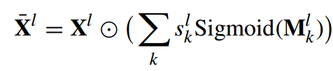

# Learning Resolution-Adaptive Representations for Cross-Resolution Person Re-Identification

IEEE TRANSACTIONS ON IMAGE PROCESSING

- varying-length representation
- resolution-adaptive mechanism
- We propose a novel progressive training strategy

In contrast, this paper proposes a method that has its own differences: first, our method does not need excessive feature extraction for cross-resolution matching; and second we directly learn resolution-adaptive representations which are amenable for cross-resolution comparison.

## PROPOSED METHOD

### Problem Statement and Framework Overview

训练的目标是学习resolution-adaptive 度量，如下

$$dist(x_p, x_g) = M(x_p, x_g, k)$$

其中M是训练的模型，x_p是query，x_g是gallery，k 表示分辨率比例——与最高的分辨率的长/宽的比例e.g., k ∈ {1, 1/2, 1/3, 1/4}；
k使得此度量是resolution-adaptive

For example, if the highest resolution corresponds to 256 × 128 per person image, i.e., its resolution ratio k = 1, for a LR image of size 64×32, its resolution ratio becomes k = 1/4.

In our algorithm, we resize all the images, whether LR or HR,to equal to the size of the highest resolution images via bilinear up-sampling. Then, each full-resolution image is down-sampled at different specified ratios to form its LR alternations.

>训练中使用的LR也是人工生成的——HR减采样再双线性插值——将所有图像resize到同一大小，也许是方便训练

假设分辨率k是可预测的；

We assume that the resolutions of both the query and gallery images are provided. In practice, the resolution could be estimated from the size (number of pixels) of images or pedestrian bounding boxes since the height of people is relatively fixed

关于M的实现，M学习resolution-adaptive表示，通过一下两个机制实现:

- varying-length representation
  - varying dimensions to encode a query image
- injecting resolutionspecific masks
  - inject into the intermediate residual feature blocks
  - to further extract resolution-specific information

resolution-adaptive representations与resolution-invariant features对比：`However, since the resolution of the query image is not fixed, learning resolution-invariant features will identify discriminative information that are shared across all resolutions. Consequently, the information specific to resolutions higher than the lowest one will not be preserved.This inevitably prevent the network from using more information for matching a moderate LR query to HR gallery images.`

### Mechanism 1: Learning Varying-Length Resolution-Adaptive Representations

**motivation:**`a HR image should contain all the information conveyed in the LR image, but also extra information from the higher resolution`

we define m sub-vectors {$v_k$ }, k = 1, · · · , m
一个可变长度的特征，用多个可变维度向量表示；每个子向量$v_k$表示对应分辨率k的特征
$$
\begin{align*}
\mathbf{z}_p&=cat(\mathbf{v}_1^p,\cdots,\mathbf{v}_k^p,\mathbf{v}_{k+1:m}^p)\\
\mathbf{z}_g&=cat(\mathbf{v}_1^g,\cdots,\mathbf{v}_k^g,\cdots,\mathbf{v}_{m}^g)\\
\mathbf{\hat{z}}_p&=cat(\mathbf{v}_{1:k}^p)\\
\mathbf{\hat{z}}_g&=cat(\mathbf{v}_{1:k}^g)\\
dis(x_p,x_g)&=\lVert \mathbf{z}_p-\mathbf{z}_g\rVert _2^2=\lVert \mathbf{\hat{z}}_p-\mathbf{\hat{z}}_g\rVert _2^2
\end{align*}
$$

>后面似乎不是直接这样用

### Mechanism 2: Resolution-Adaptive Masking

The above varying-length representation only adaptively constructs the resolution-specific representation in the penultimate layer of the neural network. To extract more resolutiondependent features, we propose a mechanism to inject the resolution characteristics into the earlier layers of a neural network.

### Varying-Length Sub-Vectors With Resolution Variations

However, a deep feature representation outputted from neural networks has a fixed-size dimension, making it challenging to define varied feature dimension corresponding to different resolution levels.

$\mathbb{R}^{d\times C}$

$\mathbf{e}^k=$

### Resolution-Adaptive Representation Training

we propose to apply zero-padding, i.e., concatenating “0” to the representation whose dimension is less than the maximal dimension, to convert a varying-length representation to a fixed-length representation.
