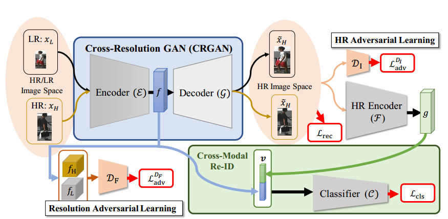

# Recover and Identify:A Generative Dual Model for Cross-Resolution Person Re-Identification

Yu-Jhe Li
2019 IEEE/CVF International Conference on Computer Vision (ICCV)

## 引言

目前re-ID问题：

- 监控相机的图片常是低分辨率(LR)的，而图库中都是高分辨率(HR)的，直接识别会有分辨率失配(resolution mismatch)问题
- 直接应用超分辨率(super-resolution)模型只能提高相应倍数的分辨率
  >

文章工作：

- 提出了一种端到端的可训练网络，该网络对跨分辨率的人re-ID进一步使用对抗性学习策略
- 恢复LR输入图像中缺失的细节，学习分辨率不变的表示
- 能够处理具有不同甚至看不见的分辨率的查询图像，而无需预先确定输入分辨率
- 在五个具有挑战性的数据集上的大量实验结果证实，我们的方法与最先进的人员再识别方法相比表现良好

## 框架

$X_H$是高分辨率的图集，$X_L$是对$X_H$减采样再双线性插值至原图大小得到图集。$Y_H,Y_L$分别是$X_H,X_L$的标签,两者完全一样.

$$
\begin{align*}
    X_H&=\{x^H_i\}^N_{i=1},x^H_i\in \mathbb{R}^{H\times W\times 3}\\
    Y_H&=\{y^H_i\}^N_{i=1},y^H_i\in \mathbb{R}\\
    X_L&=\{x^L_i\}^N_{i=1},x^L_i\in \mathbb{R}^{H\times W\times 3}\\
    Y_L&=\{y^L_i\}^N_{i=1},y^L_i\in \mathbb{R}
\end{align*}
$$

由两部分组成,Cross-Resolution GAN和Cross-Modal Re-ID network.

CRGAN学习resolution-invariant representation $f\in \mathbb{R}^{h\times w\times d}$。
Cross-Modal Re-ID将$v=[f,g]\in \mathbb{R}^{h\times w\times 2d}$作为输入进行分类。

## Cross-Resolution GAN

### encoder $\mathcal{E}$

用来提取出跨分辨率图像的分辨率不变特征。
使用对抗学习的策略，引入判别器$\mathcal{D}_F$，feature-level adversarial loss $\mathcal{L}^{\mathcal{D}_F}_{adv}$ 如下：
$$
\begin{align*}
    \mathcal{L}^{\mathcal{D}_F}_{adv}&=\mathbb{E}_{x_H\sim X_H}[log(\mathcal{D}_F(f_H))]\\&+
    \mathbb{E}_{x_L\sim X_L}[log(1-\mathcal{D}_F(f_L))]
\end{align*}
$$
其中 $f_H=\mathcal{E}(x_H),f_L=\mathcal{E}(x_L)\in \mathbb{R^{h\times w\times d}}$分别是HR和LR图像的特征。

### High-resolution decoder $\mathcal{G}$

decoder $\mathcal{G}$输出重建的HR图像，得到的图像修复了LR失去的细节。HR reconstruction loss $\mathcal{L}_{rec}$ 如下：
$$
\begin{align*}
    \mathcal{L}_{rec}&=\mathbb{E}_{x_H\sim X_H}[\lVert \mathcal{G}(f_H)-x_H\rVert _1]\\
    &+\mathbb{E}_{x_L\sim X_L}[\lVert\mathcal{G}(f_L)-x_H\rVert _1]
\end{align*}
$$

- $x_H$是$x_L$的ground-truth图像
- 采用1范数保留图像的清晰度
- (?)在训练中$X_H,X_L$两者都会搅乱(shuffled)，所以不一定会同时观察到相同身份但不同分辨率的图像
  >We note that both XH and XL will be shuffled during training. That is, images of the same identity but different resolutions will not necessarily be observed by CRGAN at the same time.
- encoder $\mathcal{E}$,decoder $\mathcal{G}$之间还引进了一个跳跃连接,使梯度传播更有效

为了使decoder $\mathcal{G}$ 产生视觉上更真实的HR图像，并关联到人物re-ID任务上，文章在图像空间上应用对抗性学习，并引进了 判别器$\mathcal{D}_I$。判别器$\mathcal{D}_I$用于区分重建图像——即$\mathcal{G}(f_L),\mathcal{G}(f_H)$——和groud-truth图像$x_H$。损失函数如下：
$$
\begin{align*}
    \mathcal{L}^{\mathcal{D}_I}_{adv}&=\mathbb{E}_{x_H\sim X_H}[log(\mathcal{D}_I(x_H))]+
    \mathbb{E}_{x_L\sim X_L}[log(1-\mathcal{D}_I(\mathcal{G}(f_L)))]\\
    &+\mathbb{E}_{x_H\sim X_H}[log(\mathcal{D}_I(x_H))]+
    \mathbb{E}_{x_H\sim X_H}[log(1-\mathcal{D}_I(\mathcal{G}(f_H)))]
\end{align*}
$$

## Cross-Modal Re-ID

encoder $\mathcal{F}$ 作用与重建的HR图像，导出HR特征表示 $g\in \mathbb{R}^{h\times w\times d}$。
$f,g$的区别：

- $f$ 保留了内容信息
- $g$ 观察到恢复的HR细节

将 $v=[f,g]\in \mathbb{R}^{h\times w\times 2d}$ 作为分类器 $\mathcal{C}$ 输入
训练分类器 $\mathcal{C}$ 的损失函数如下：

$$
\mathcal{L}_{cls}=\mathcal{L}_{id}+\mathcal{L}_{tri}
$$

由两部分组成:

- identity loss $\mathcal{L}_{id}$ 计算分类器预测结果和相关的ground-truth one-hot 向量的 softmax 交叉熵(cross-entropy)
  - $softmax(z_i)=\frac{exp(z_i)}{\sum_{i}exp(z_i)}$
  - 交叉熵：$H(P,Q)=\mathbb{E}_{x\sim P}[-log_2Q(x)]$
- triplet loss $\mathcal{L}_{tri}$，定义为:$$
\begin{align*}
    \mathcal{L}_{tri}&=\mathbb{E}_{(x_H,y_H)\sim (X_H,Y_H)}[max(0,\phi +d_{pos}^H-d_{neg}^H)]\\
    &+\mathbb{E}_{(x_L,y_L)\sim (X_L,Y_L)}[max(0,\phi +d_{pos}^L-d_{neg}^L)]
\end{align*}$$
  - $d_{pos},d_{neg}$ (应该是分类器 $\mathcal{C}$ 中的距离)分别是到正例的距离和反例的距离
  - $\phi>0$ 作为margin
  >
  $L<margin,i.e.,d(a,p)<d(a,n)<d(a,p)+margin$ 距离p比n近，但近得不够多，需要优化。

## 总目标

总的损失函数：
$$
\mathcal{L}=\mathcal{L}_{cls}+\mathcal{\lambda}_{adv}^{\mathcal{D}_F}\cdot\mathcal{L}_{adv}^{\mathcal{D}_F}+\mathcal{\lambda}_{rec}\cdot\mathcal{L}_{rec}+\mathcal{\lambda}_{adv}^{\mathcal{D}_I}\cdot\mathcal{L}_{adv}^{\mathcal{D}_I}
$$
其中$\mathcal{\lambda}_{adv}^{\mathcal{D}_F},\mathcal{\lambda}_{rec},\mathcal{\lambda}_{adv}^{\mathcal{D}_I}$ 是超参数.

- $\mathcal{L}_{adv}^{\mathcal{D}_F},\mathcal{L}_{rec},\mathcal{L}_{adv}^{\mathcal{D}_I}$ 与训练CRGAN相关
- $\mathcal{L}_{cls}$ 与训练CRGAN和cross-modal re-ID network都相关

## 实验

上图是五个数据集的定量结果
JUDEA等是CR person re-ID方法,CamStyle等是标准的person re-ID方法.

上图是关于重建的HR图片的定量结果；unseen是没有在训练中采用的数据。

上图是对Resolution-Invariant Representation $f$ 进行池化后的 $w=GAP(f)$ 的可视化结果

上图是消融研究结果

- 虽然没有$\mathcal{L}_{cls}$也能重建出HR图像，但是在re-ID方面几乎没有效果了
